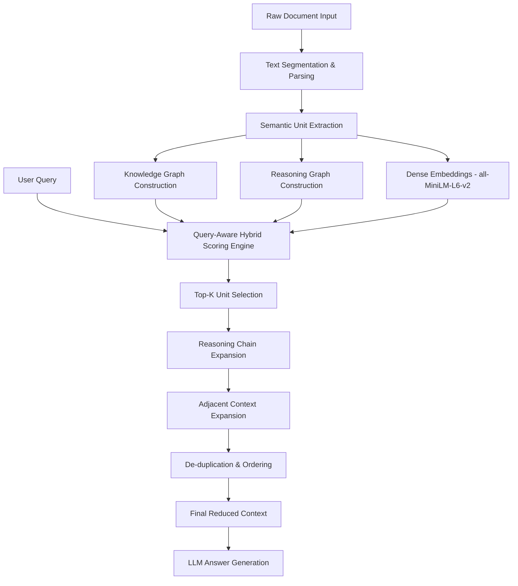

# ✂️ SCRE: Sentence-level Context Reduction Engine

[](https://www.python.org/)
[](LICENSE)
[](README.md)
[](tests/benchmark_results.json)
[](SCRE_DEEPDIVE.html)

> **ℹ️ STATUS:** SCRE is a **research-grade, benchmark-validated** library under active development (75-doc evaluation, 100 Q&A pairs, SPS 84.36). Core APIs (`ingest`, `retrieve`, `reduce`) are stable. The extraction strategy chain and scoring weights are subject to change. **Not recommended for mission-critical production workloads** without independent evaluation on your target domain.

---

## 📖 Overview

**SCRE** (Sentence-level Context Reduction Engine) is a query-aware context compression library built for Retrieval-Augmented Generation (RAG) pipelines and LLM serving systems. It is **not** a traditional vector search or BM25 retriever — it reasons about *semantic structure* and compresses documents while preserving the logical, causal, and procedural relationships that matter to your query.

### The Problem

Modern LLMs have massive context windows, but stuffing them with raw documents is counterproductive:

- 📈 **Increased Latency** — Longer context = slower generation
- 💸 **Higher API Costs** — Every token costs money
- 🤔 **Lost-in-the-Middle** — LLMs lose focus when surrounded by noise
- 🔗 **Broken Reasoning Chains** — Naive retrieval breaks causal links

SCRE sits between your retrieval layer and your LLM, acting as an intelligent semantic compression filter.

> 💡 **See it in action:** [WORKFLOW_EXAMPLE.md](WORKFLOW_EXAMPLE.md) walks through the same document and query across all four strategies — Raw Context, BM25, Vector Search, and SCRE — showing exactly what each retrieves and why.

---

## 🏗️ Architecture



---

## ⚙️ Pipeline Stages

SCRE executes in **six distinct stages** on every `ingest()` + `retrieve()` call:

### 1️⃣ Ingestion & Intelligent Parsing
- Raw text is split into semantic paragraphs and individual sentences
- Preserves complex structures: markdown lists, key-value headers, code blocks
- Detects and consolidates multi-line `Label:\nValue` patterns to prevent fragmentation
- Maintains narrative context across sentence boundaries

### 2️⃣ Semantic Unit Classification
Each sentence is classified into one of the following semantic types using a **two-stage strategy pipeline**:

| Type | Description | Example Signal |
|------|-------------|----------------|
| `decision` | Critical choices or selections | "chose", "decided", "selected" |
| `constraint` | Requirements or limitations | "must", "cannot", "required" |
| `workflow` | Ordered process steps | Markdown list following a header |
| `fact` | Definitions or factual statements | Default fallback |
| `reason` | Causal or justification statements | "because", "due to", "enables" |
| `goal` | Purpose or mission statements | "goal", "protect", "preserve" |
| `task` | Action items or TODOs | "implement", "create", "benchmark" |
| `outcome` | Results or consequences | "caused", "resulted", "outcome" |
| `comparison` | Trade-off or contrast | "versus", "faster than", "better" |

**Extraction Strategy Chain:**
1. Regex-based SDLC tag matcher (`[DEC-01]`, `[CON-02]`, etc.)
2. Markdown key-value extractor (`Requirement: ...`, `Decision: ...`)
3. spaCy NLP dependency parser (POS tagging, named entity recognition, subtrees)

### 3️⃣ Dual Graph Construction

**Knowledge Graph** — Entity adjacency list:
- Connects subjects and objects across semantic units
- Powers connectivity scoring: units with high entity co-occurrence are ranked higher

**Reasoning Graph** — Causal chain graph:
- Links `decision → constraint`, `reason → decision`, `task → goal` etc.
- Detects lexical causal markers: `because`, `due to`, `depends on`, `satisfies`, `violates`
- Enables **multi-hop traversal** during retrieval

### 4️⃣ Query-Aware Hybrid Scoring
Each semantic unit is scored against the incoming query using a **composite formula**:

```
score = (type_weight × 2.0)
      + lexical_similarity   # IDF-weighted term overlap, non-linear multi-term boost
      + phrase_bonus         # +5.0 for exact phrase match
      + dense_bonus          # cosine similarity × [2–12] depending on confidence tier
      + entity_match         # +3.0 per named entity match
      + noun_match           # +2.0 per noun chunk match
      + relationship_dist    # graph connectivity bonus (capped at 1.0)
      + intent_bonus         # +3.0 when unit type aligns with query intent
      + hard_id_boost        # +15.0 per exact alphanumeric identifier match
```

Dense embeddings use `all-MiniLM-L6-v2` (fast inference, high quality). The evaluation suite uses `all-mpnet-base-v2` for stricter semantic similarity verification at `threshold ≥ 0.80`.

### 5️⃣ Context Expansion
After top-K selection, SCRE expands the result set:

- **Adjacent Context Expansion** (`context_window`) — Includes ±N neighbouring sentences to resolve pronouns and preserve local coherence
- **Reasoning Chain Expansion** — Performs 2-hop traversal on the reasoning graph to pull in causes and consequences of selected nodes

### 6️⃣ Final Assembly
- De-duplicates by Jaccard similarity (threshold 0.85)
- Re-orders by original sentence index to maintain narrative flow
- Injects context headers (`[Section Title]`) to prevent context detachment
- Returns clean context block + compression metrics

---

## 📊 Benchmark Results

### Evaluation Setup

| Parameter | Value |
|-----------|-------|
| **Dataset** | 75 documents (25 Kubernetes KEPs + 50 IETF RFCs) |
| **Q&A Pairs** | 100 (2 per KEP, 1 per RFC) |
| **Embedding Model** | `all-mpnet-base-v2` |
| **Similarity Threshold** | ≥ 0.80 cosine similarity |
| **Benchmark Script** | `tests/unified_benchmark.py` |
| **Document Selection** | Only documents with Summary + Motivation + Design + Alternatives + Constraints + Reasoning sections |

### What Each Metric Means

| Metric | One-liner |
|--------|-----------|
| **SPS Score** | *Composite score (0–100) combining all metrics below using weighted priorities. The headline number for comparing strategies.* |
| **Constraint Recall** | *Did the retrieved context preserve the rules and requirements? ("must", "cannot", "required" sentences)* |
| **Decision Traceability** | *Did the retrieved context preserve the choices made and why they were made?* |
| **Workflow Integrity** | *Did the retrieved context preserve process steps and procedural logic?* |
| **Reasoning Recall** | *Did the retrieved context preserve the motivation and justification behind decisions?* |
| **Reasoning Graph Recall** | *Did the retrieved context preserve causal chains — i.e. are cause and effect sentences both present together?* |
| **Dependency Recall** | *Did the retrieved context preserve cross-document references and citations?* |
| **Compression Ratio** | *What percentage of the original document was removed? Higher = fewer tokens sent to the LLM.* |
| **Avg Context Tokens** | *Average token count of the retrieved context across all 100 test queries.* |
| **Latency (ms)** | *Time to perform retrieval per query (excluding model loading).* |
| **SER** | *Semantic Efficiency Ratio — SPS score per token. How much semantic value per token spent.* |

### Strategy Comparison

| Metric | Raw Context | BM25 | Vector Search | **SCRE** |
|--------|:-----------:|:----:|:-------------:|:--------:|
| **SPS Score** | 97.40 | 76.53 | 77.32 | **84.36** |
| **Constraint Recall** | 97.0% | 76.0% | 77.3% | **82.8%** |
| **Decision Traceability** | 96.7% | 77.2% | 77.7% | **85.8%** |
| **Workflow Integrity** | 98.3% | 76.3% | 77.0% | **83.7%** |
| **Reasoning Recall** | 100.0% | 100.0% | 100.0% | **100.0%** |
| **Reasoning Graph Recall** | 100.0% | 0.04% | 0.02% | **12.45%** |
| **Dependency Recall** | 100.0% | 0.0% | 0.04% | **0.0%** |
| **Compression Ratio** | 0.0% | 96.0% | 96.1% | **80.5%** |
| **Avg Context Tokens** | 5,796 | 92 | 90 | **518** |
| **Latency (ms)** | 0.004 | 0.86 | 58.70 | **62.58** |
| **SER (Score/Token)** | 182 | 7,653 | 7,732 | **1,764** |

### Key Findings

- **SCRE preserves 84.36% of the semantic properties** of source documents while compressing **80.5% of token volume**
- **BM25 and Vector Search destroy reasoning graph structure** — Reasoning Graph Recall drops to near 0% because they return disconnected sentences without traversing causal chains
- **SCRE's Decision Traceability (85.8%)** exceeds both baselines by ~8.6pp — it follows decision-reason-implementation chains
- **Raw Context scores 97.4 SPS** but at 5,796 avg tokens, it provides no compression benefit

### SPS Formula

```
SPS = (reasoning_recall × 0.30)
    + (constraint_recall × 0.25)
    + (decision_traceability × 0.20)
    + (workflow_integrity × 0.15)
    + (general_retention × 0.10)
    × 100
```

**Why these weights?** The weights are deliberate design choices reflecting what matters most in technical document RAG — they are not mathematically optimised. Reasoning (0.30) is weighted highest because a context that drops *why* a decision was made is misleading to an LLM. Constraints (0.25) are next because missing hard rules (`must`/`cannot`) can produce incorrect outputs. General factual retention (0.10) is lowest because that is what BM25 and Vector Search already do — it is the least differentiating capability. All weights sum to 1.0 and can be tuned per domain (e.g. a compliance use-case could raise constraints to 0.40).

---

## 📦 Installation

### From Source (Development)

```bash
git clone https://github.com/aparajithguha/Sentence_Level_Context_Reduction_Engine.git
cd Sentence_Level_Context_Reduction_Engine

# Create virtual environment
python -m venv venv && source venv/bin/activate

# Install in editable mode with all dependencies
pip install -e .[all]

# Download required spaCy NLP model
python -m spacy download en_core_web_sm
```

### Dependencies

| Component | Package | Purpose |
|-----------|---------|---------|
| **Core** | `spacy≥3.0.0` | NLP, entity recognition, POS tagging |
| **ML** | `sentence-transformers` | Dense semantic embeddings |
| | `torch` | Deep learning backend |
| | `tiktoken` | Accurate token counting (cl100k_base) |
| **Dashboard** | `streamlit` | Interactive evaluation UI |
| | `plotly` | Radar charts and network graphs |
| | `networkx` | Graph layout and visualization |
| **Eval** | `rank_bm25` | BM25 baseline comparisons |

---

## ⚡ Quick Start

### Basic Usage

```python
from scre.query_aware_reducer import SCRE

engine = SCRE()

document_text = """
The database chosen was PostgreSQL. It was selected because of its ACID compliance.
All writes must use transactions. Reads can use connection pooling.
The team decided to use read replicas for analytics workloads.
"""

result = engine.reduce(
    text=document_text,
    query="Why did we select PostgreSQL?",
    max_sentences=3,
    context_window=1
)

print(result["context"])
print(f"Compressed: {result['metadata']['reduction_ratio']:.1%}")
print(f"Tokens: {result['metadata']['reduced_estimated_tokens']}")
```

### Ingest-then-Retrieve (Persistent Mode)

```python
from scre.query_aware_reducer import SCRE

# Persistent SQLite-backed engine (survives across queries)
engine = SCRE(db_path="scre_memory.db")

# Ingest once
engine.ingest(document_text, document_id="postgres-adr-2024")

# Retrieve multiple times with different queries
r1 = engine.retrieve("Why PostgreSQL?", document_id="postgres-adr-2024", max_sentences=4)
r2 = engine.retrieve("What are the constraints?", document_id="postgres-adr-2024", max_sentences=4)
```

---

## 🖥️ Interactive Dashboard

SCRE ships with a research-grade Streamlit dashboard for exploration and evaluation:

```bash
streamlit run dashboard.py
```

**Dashboard Tabs:**
1. **📊 Performance Dashboard** — Full benchmark results table + radar chart comparison
2. **🔌 Graph Explorer** — Interactive network graph of reasoning edges per document
3. **🛝 Playground & Comparison** — Side-by-side BM25 vs Vector vs SCRE retrieval for any document/query pair

---

## 🧪 Running Benchmarks

```bash
# Full evaluation suite (75 docs, 100 Q&As)
python tests/unified_benchmark.py

# View results
cat tests/benchmark_results.json

# Launch dashboard
streamlit run dashboard.py
```

---

## 🗂️ Project Structure

```
SCRE/
├── scre/
│   ├── query_aware_reducer.py      # Core engine: parsing, graphs, scoring, retrieval
│   ├── scre_pipeline.py            # End-to-end pipeline (ingest → reduce → answer)
│   └── scre_answer_engine.py       # LLM integration (Ollama)
│
├── tests/
│   ├── unified_benchmark.py        # Research-grade evaluation suite (75 docs, 100 Q&As)
│   ├── benchmark_results.json      # Latest benchmark output
│   ├── benchmark_results.csv       # CSV export for analysis
│   └── benchmark_history.json      # Run history
│
├── data/                           # Benchmark corpora & agent prompt templates
├── dashboard.py                    # Streamlit interactive dashboard
├── WORKFLOW_EXAMPLE.md             # Step-by-step retrieval comparison walkthrough
├── SCRE_DEEPDIVE.html              # Full technical deep-dive document
└── pyproject.toml                  # Project configuration
```

---

## 🔧 Configuration

### SCRE Constructor

```python
engine = SCRE(
    model="en_core_web_sm",   # spaCy model for NLP
    db_path=":memory:",        # SQLite path — use file path for persistence
    extractors=[...]           # Optional: custom extraction strategy chain
)
```

### Retrieve Parameters

```python
result = engine.retrieve(
    query="...",
    document_id="...",
    max_sentences=6,       # Max semantic units to select
    context_window=1,      # Adjacent sentence expansion radius
    min_tokens=250,        # Minimum token floor (prevents under-retrieval)
    max_tokens=None        # Optional hard token ceiling
)
```

### Return Schema

```python
{
    "context": "...",          # The compressed context string
    "metadata": {
        "original_sentences": 660,
        "reduced_sentences": 15,
        "original_chars": 45769,
        "reduced_chars": 3641,
        "original_estimated_tokens": 10325,
        "reduced_estimated_tokens": 877,
        "reduction_ratio": 0.9204
    }
}
```

---

## 🎯 Use Cases

### RAG Pipeline Compression
```python
retrieved_docs = vector_db.search(query, top_k=10)
full_context = "\n".join(retrieved_docs)

compressed = engine.reduce(full_context, query, max_sentences=5)
answer = llm.chat(query, context=compressed["context"])
```

### Cost-Aware Production Serving
```python
result = engine.reduce(text=raw_doc, query=user_query, max_sentences=3)
token_savings = (result["metadata"]["original_estimated_tokens"]
                 - result["metadata"]["reduced_estimated_tokens"])
print(f"Saved {token_savings} tokens (~${token_savings * 0.000003:.4f} at GPT-4 pricing)")
```

---

## 🚀 Roadmap

- [x] Semantic unit extraction with type classification
- [x] Dual-graph construction (Knowledge + Reasoning)
- [x] Dense + sparse hybrid scoring
- [x] Reasoning chain multi-hop expansion
- [x] Persistent SQLite-backed memory store
- [x] Research-grade benchmark suite (75 docs, 100 Q&As)
- [x] Interactive Streamlit dashboard with graph explorer
- [ ] LangChain / LlamaIndex retriever integration
- [ ] Multi-language support (multilingual MiniLM)
- [ ] Streaming context expansion
- [ ] Fine-tuned domain-specific extraction models
- [ ] Production monitoring & observability hooks

---

## 📚 Documentation

| Document | Description |
|----------|-------------|
| [README.md](README.md) | This file — project overview and quick start |
| [WORKFLOW_EXAMPLE.md](WORKFLOW_EXAMPLE.md) | Step-by-step retrieval comparison (Raw vs BM25 vs Vector vs SCRE) |
| [SCRE_DEEPDIVE.html](SCRE_DEEPDIVE.html) | Full technical architecture, scoring formula, and benchmark analysis |
| [BENCHMARK_REPORT.md](BENCHMARK_REPORT.md) | Auto-generated benchmark narrative report |

---

## 📝 License

MIT License — see [LICENSE](LICENSE) for details.

---

## 🙏 Acknowledgments

Built with [spaCy](https://spacy.io/), [Sentence-Transformers](https://www.sbert.net/), [Streamlit](https://streamlit.io/), [Plotly](https://plotly.com/), and [NetworkX](https://networkx.org/).
