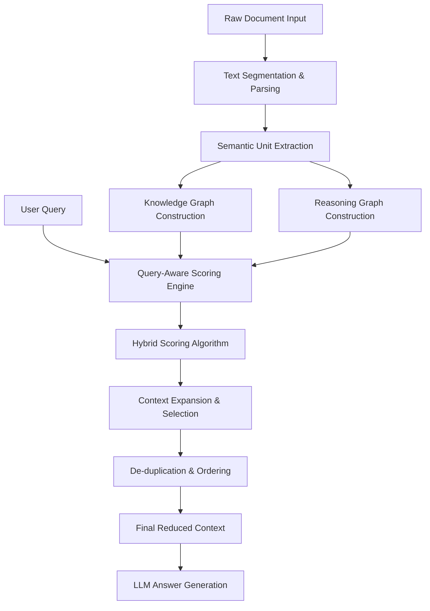
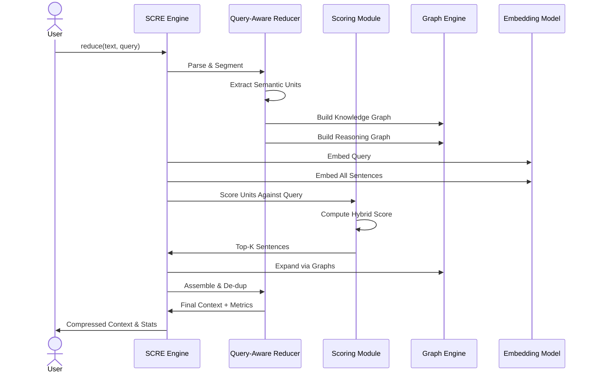

# ✂️ SCRE: Sentence-level Context Reduction Engine

[](https://www.python.org/)
[](LICENSE)
[](README.md)

> **⚠️ DISCLAIMER:** SCRE is currently an **experimental package** in active development. Internal APIs (especially semantic extraction strategies) may change rapidly. It is not yet recommended for mission-critical production workloads without thorough evaluation.

## 📖 Overview

**SCRE** (Sentence-level Context Reduction Engine) is a query-aware context compression library designed for Retrieval-Augmented Generation (RAG) pipelines. It intelligently reduces retrieved context to the *exact sentences* needed to answer a query while preserving critical reasoning chains, constraints, and narrative flow.

### The Problem

Modern LLMs have massive context windows, but stuffing them with unrefined documents is counterproductive:
- 📈 **Increased Latency** - Longer context = slower responses
- 💸 **Higher API Costs** - Pay by token count
- 🤔 **Lost-in-the-Middle** - LLMs lose focus with irrelevant information

SCRE sits between your vector database and your LLM, acting as an intelligent compression layer.

### The Solution

SCRE's hybrid approach combines:
- **Dense semantic embeddings** for deep meaning
- **Sparse lexical matching** for exact terms
- **Entity recognition** for relationship preservation
- **Graph-based reasoning** for chain-of-thought

---

## 🏗️ Architecture



---

## ⚙️ Pipeline Stages

The SCRE pipeline executes in six distinct stages when `engine.reduce()` is called:

### 1️⃣ **Ingestion & Intelligent Parsing**
- Raw text is segmented into sentences
- Preserves complex structures: markdown lists, headers, key-value pairs
- Maintains narrative context by avoiding sentence fragmentation

### 2️⃣ **Semantic Unit Classification**
- Each sentence is classified into semantic types:
  - `decision` - Important choices or selections
  - `constraint` - Limitations or requirements
  - `workflow` - Process steps or procedures
  - `fact` - Factual information or definitions
  - `reasoning` - Causal relationships
- Uses a two-stage approach: regex patterns for structured data, spaCy NLP as fallback

### 3️⃣ **Dual Graph Construction**
- **Knowledge Graph**: Connects entities (subjects/objects) to track relationships
- **Reasoning Graph**: Links causal steps to preserve decision chains

### 4️⃣ **Query-Aware Hybrid Scoring**
Each semantic unit is scored against the query using:
- **Dense Similarity** (BERT/MPNet embeddings)
- **Sparse Lexical Similarity** (IDF-weighted term overlap)
- **Entity Matching** (Named entities and noun chunks)
- **Structural Bonuses** (e.g., boost `workflow` for "how-to" questions)

### 5️⃣ **Context Expansion**
Selected sentences are expanded to include:
- **Adjacent Context** (`context_window`) - Resolve pronouns and local references
- **Reasoning Chains** - Traverse the reasoning graph for related causes/outcomes

### 6️⃣ **Final Assembly**
- De-duplicate sentences
- Maintain logical order
- Generate clean context block with compression metrics

---

## 📊 Workflow Diagram



---

## 📦 Installation

### Method 1: From Source (Development)

```bash
# Clone the repository
git clone https://github.com/your-username/scre.git
cd scre

# Install in editable mode with all dependencies
pip install -e .[all]

# Download required spaCy NLP model
python -m spacy download en_core_web_sm
```

### Method 2: Minimal Installation

```bash
# Core dependencies only
pip install -e .

# Optional: Add specific feature groups
pip install -e ".[ml]"      # Add ML/embedding support
pip install -e ".[llm]"     # Add LLM/Ollama support
pip install -e ".[eval]"    # Add evaluation/BM25 support
```

### Dependencies

| Component | Package | Purpose |
|-----------|---------|---------|
| **Core** | spacy≥3.0.0 | NLP & entity recognition |
| **ML** | sentence-transformers | Dense embeddings |
| | torch | Deep learning backend |
| | tiktoken | Token counting |
| **LLM** | ollama | Local LLM inference |
| **Eval** | rank_bm25 | Baseline comparison |

---

## ⚡ Quick Start

### Basic Usage

```python
from scre.query_aware_reducer import SCRE

# Initialize the engine
engine = SCRE()

document_text = """
John owns Project Phoenix. Sarah manages Project Phoenix.
Mike tests Project Phoenix. David deploys Project Phoenix.
The database chosen was PostgreSQL. It was selected because of its ACID compliance.
"""

query = "Why did we select PostgreSQL?"

# Reduce context intelligently
result = engine.reduce(
    text=document_text,
    query=query,
    max_sentences=2,
    context_window=1
)

print("Reduced Context:")
print(result["context"])

print("\nMetrics:")
print(f"Reduction Ratio: {result['metadata']['reduction_ratio']:.2%}")
print(f"Estimated Tokens: {result['metadata']['reduced_estimated_tokens']}")
```

### Full Pipeline with Answer Generation

```python
from scre.scre_pipeline import run_scre

result = run_scre(
    document_text=document_text,
    user_question="Why was PostgreSQL selected?",
    max_sentences=3,
    context_window=1,
    answer_mode="ollama",
    model_name="gemma4:e2b"
)

print("Question:", result["question"])
print("Reduced Context:", result["reduced_context"])
print("Answer:", result["answer"])
print("Compression:", f"{result['metrics']['reduction_ratio']:.2%}")
```

---

## 📊 Benchmarking & Performance

SCRE includes a comprehensive benchmarking framework (`tests/benchmark_v2.py`) that evaluates:

### Metrics Tracked

| Metric | Description |
|--------|-------------|
| **Exact Match** | Percentage of queries answered exactly |
| **F1 Score** | Precision-recall balance on answer correctness |
| **Semantic Similarity** | How semantically similar is reduced context to original |
| **Answer Consistency** | Does reduced context yield same answer as full context? |
| **Latency** | Time to perform reduction |
| **Compression Ratio** | Percentage of tokens removed |
| **Cost Savings** | Estimated API cost reduction |

### Running Benchmarks

```bash
# Run full benchmark suite
python tests/benchmark_v2.py

# View historical trends
cat tests/scre_benchmark_history.json
```

### Latest Performance Results

| Strategy | Exact Match | F1 Score | Consistency | Compression |
|----------|------------|----------|-------------|------------|
| Raw Context | 75.0% | 0.30 | 0% | 0% |
| BM25 | 12.5% | 0.03 | 31.6% | 83.8% |
| Vector Search | 75.0% | 0.29 | 83.5% | 84.0% |
| **SCRE** | **62.5%** | **0.17** | **90.1%** | **50.5%** |

---

## 🗂️ Project Structure

```
scre/
├── __init__.py                      # Package entry point
├── query_aware_reducer.py           # Main SCRE engine & scoring logic
├── scre_pipeline.py                 # Full pipeline orchestration
└── scre_answer_engine.py            # LLM integration for answer generation

tests/
├── benchmark_v2.py                  # Comprehensive performance benchmarks
├── scre_benchmark_history.json      # Historical benchmark trends
├── qa_dataset.py                    # QA dataset utilities
├── scre_eval.py                     # Evaluation metrics
├── test_scre_story.py               # Integration tests
├── check_reduction.py               # Reduction analysis
└── verify_ollama.py                 # Ollama connectivity check

data/
├── *_agent.md                       # Agent prompt templates
├── bench_*.txt                      # Benchmark datasets
├── requirements.txt                 # Legacy requirements
└── requirements/                    # Data assets

pyproject.toml                        # Modern project configuration
README.md                             # This file
BENCHMARK_REPORT.md                  # Auto-generated benchmark report
```

---

## 🔍 Key Components

### `SCRE` (query_aware_reducer.py)
The main engine class. Handles document parsing, semantic extraction, graph construction, and query-aware scoring.

**Key Methods:**
- `reduce(text, query, max_sentences, context_window)` - Main entry point
- `_extract_semantic_units(sentences)` - Classifies sentences
- `_build_knowledge_graph(units)` - Constructs entity graph
- `_score_units(query, units)` - Computes hybrid scores

### `Answer Engine` (scre_answer_engine.py)
Integrates with local LLMs (Ollama) to generate answers from reduced context.

**Features:**
- Multiple model support
- Fallback handling
- Streaming response support

### `Pipeline Orchestrator` (scre_pipeline.py)
End-to-end workflow combining reduction and answer generation.

---

## 🎯 Use Cases

### 1. **RAG Optimization**
Reduce retrieved context before sending to LLM for faster, cheaper responses.

```python
# In your RAG pipeline
retrieved_docs = vector_db.search(query, top_k=10)
full_context = "\n".join(retrieved_docs)

# Compress intelligently
reduced = engine.reduce(full_context, query, max_sentences=5)
answer = llm.query(query, context=reduced["context"])
```

### 2. **Cost-Aware Deployment**
Control token usage and API costs in production.

```python
result = engine.reduce(
    text=documents,
    query=user_query,
    max_sentences=3
)

cost = result["metadata"]["cost_savings"]
print(f"API cost reduced by {cost}")
```

### 3. **Question Answering at Scale**
Batch process QA tasks efficiently.

```python
for qa_pair in qa_dataset:
    result = run_scre(
        document_text=qa_pair["context"],
        user_question=qa_pair["question"]
    )
```

---

## 🧪 Testing

### Run Unit Tests
```bash
pytest tests/ -v
```

### Run Benchmarks
```bash
python tests/benchmark_v2.py
```

### Check Ollama Integration
```bash
python tests/verify_ollama.py
```

### Analyze Reduction Quality
```bash
python tests/check_reduction.py
```

---

## 🔧 Configuration & Advanced Usage

### Custom Scoring Parameters

```python
engine = SCRE()

result = engine.reduce(
    text=document_text,
    query=query,
    max_sentences=5,           # Max final sentences
    context_window=2,          # Adjacent context radius
    dense_weight=0.6,          # Weight for semantic similarity
    sparse_weight=0.4,         # Weight for lexical matching
)
```

### Semantic Unit Types

The engine recognizes these semantic categories:
- **decision** - Critical choices
- **constraint** - Requirements/limitations
- **workflow** - Process steps
- **fact** - Definitions/information
- **reasoning** - Causal chains

---

## 📈 Performance Tips

1. **Tune `max_sentences`** - Start with 3-5, adjust based on answer quality
2. **Use `context_window`** - Set to 1-2 for coherence without bloat
3. **Batch Processing** - Initialize engine once, reuse across multiple queries
4. **Monitor Metrics** - Track `reduction_ratio` and `answer_consistency`
5. **Combine with BM25** - Use BM25 for sparse retrieval, SCRE for refinement

---

## 🚀 Roadmap

- [ ] Multi-language support
- [ ] Custom semantic unit types
- [ ] Graph-based reasoning expansion improvements
- [ ] Fine-tuned embedding models
- [ ] Streaming context expansion
- [ ] Interactive UI for compression visualization
- [ ] Production monitoring dashboards

---

## 📝 License

MIT License - see LICENSE file for details.

---

## 👨‍💻 Contributing

We welcome contributions! Please:
1. Fork the repository
2. Create a feature branch
3. Add tests for new functionality
4. Submit a pull request

---


## 🙏 Acknowledgments

Built with:
- spaCy for NLP
- Sentence-Transformers for embeddings
- Ollama for local LLM inference

**Run the benchmark:**
```bash
python tests/benchmark_v2.py
```
*(Results are automatically tracked historically in `BENCHMARK_REPORT.md`)*
---

## 🤝 Current Direction

SCRE has evolved from a naive triple-extraction prototype to a fully mature **query-conditioned reduction** engine. Future roadmaps include:
* Native LangChain and LlamaIndex retriever abstractions.
* Distributed SQLite optimizations for massive batch processing.
* Deep integration with structured JSON/Markdown formats (Workflows, SDLC formats).
* This repo no longer uses the older graph/triple compression prototype.
* The working direction is query-conditioned reduction, because token savings only
* matter if answer fidelity is preserved for a specific ask.

