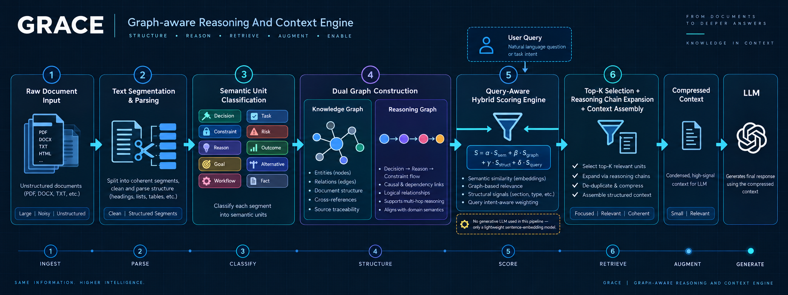

# 🌿 GRACE: Graph-aware Reasoning And Context Engine

[](https://www.python.org/)
[](LICENSE)
[](README.md)
[-brightgreen)](BENCHMARK_REPORT_sample.md)
[](BENCHMARK_PROMPT_MODE.md)

> **ℹ️ NAMING:** This project was previously called **SCRE** (Sentence-level Context Reduction Engine). The name **GRACE** better reflects what actually differentiates it — graph-aware reasoning-chain preservation and structure-aware prompt reduction, not just sentence selection. This is a documentation-level rename only: the Python package, module names, and the `SCRE` class are unchanged for backward compatibility — every code example below still reads `from scre.query_aware_reducer import SCRE`.

> **ℹ️ STATUS:** GRACE is a **research-grade** library under active development. It has two modes with different levels of evidence:
> - **Document mode** (`reduce`) — query-aware compression for RAG. Benchmarked on a 20-question / 19-document sample of Kubernetes KEPs and IETF RFCs; the earlier full-suite figures predate later fixes and are retired.
> - **Prompt mode** (`reduce_prompt`) — reduction of agent system prompts. Structurally checked on 1,690 real prompts and behavior-tested on 8 valid cases. **Promising but early**: small test set, one agent model, and the guards were tuned on some of the same cases. See [BENCHMARK_PROMPT_MODE.md](BENCHMARK_PROMPT_MODE.md) for exactly what it does and does not show.
>
> **Not recommended for mission-critical production workloads** without independent evaluation on your own prompts and documents.

---

## 📖 Overview

**GRACE** (Graph-aware Reasoning And Context Engine, package name `scre`) is a context-reduction library with two modes for two different jobs:

| | **Document mode** | **Prompt mode** |
|---|---|---|
| **Input** | A long document and a query (RAG) | A long agent system prompt (optionally a task) |
| **Entry point** | `SCRE.reduce(text, query)` | `SCRE.reduce_prompt(text, task=None, selector=None)` |
| **Idea** | Keep the sentences that answer the query, plus the causes and steps linked to them | Keep every instruction word for word; remove only what is redundant, and optionally the sections a task cannot use |
| **Output** | A compressed context of selected sentences | The original prompt with whole blocks removed |
| **Needs** | spaCy (`scre[document]`); embeddings optional | Nothing but the standard library; an LLM only if you want the LLM to choose sections |
| **Rewrites text?** | Re-renders workflows as JSON | Never |

### The Problem

Modern LLMs have massive context windows, but stuffing them with raw documents or huge system prompts is counterproductive:

- 📈 **Increased Latency** — Longer context = slower generation
- 💸 **Higher API Costs** — Every token costs money, and a system prompt is resent on every turn of an agent loop
- 🤔 **Lost-in-the-Middle** — LLMs lose focus when surrounded by noise
- 🔗 **Broken Reasoning Chains** — Naive retrieval breaks causal links

GRACE sits between your retrieval layer or prompt and your LLM, acting as a structure-aware compression filter.

> 💡 **See it in action:** the [Showcase demo](#-showcase-demo-web-ui) lets you paste a system prompt or a document and see what was kept, dropped, and why.

---

## 🏗️ Architecture



*The diagram shows document mode. Prompt mode has its own pipeline, described [below](#-prompt-mode-agent-system-prompts).*

---

## ⚙️ Document Mode: Pipeline Stages

GRACE executes in **six distinct stages** on every `reduce()` call:

### 1️⃣ Ingestion & Intelligent Parsing
- Raw text is split into semantic paragraphs and individual sentences
- Preserves complex structures: markdown lists, key-value headers, code blocks
- Detects and consolidates multi-line `Label:\nValue` patterns to prevent fragmentation
- Maintains narrative context across sentence boundaries

### 2️⃣ Semantic Unit Classification
Each sentence is classified into one of the following semantic types using a **two-stage strategy pipeline**:

| Type | Description | Example Signal |
|------|-------------|----------------|
| `decision` | Critical choices or selections | "chose", "decided", "selected" |
| `constraint` | Requirements or limitations | "must", "cannot", negation dependency (spaCy `neg`) |
| `reason` | Causal or justification statements | "because" |
| `implementation` | Concrete implementation detail | subject/object/relation triple present |
| `goal` | Purpose or mission statements | "goal", "protect", "preserve" |
| `workflow` | Ordered process steps | A numbered list, or a bullet list under a procedure-like header ("steps", "workflow", "process", "phases", ...) |
| `task` | Action items or TODOs | "implement", "create", "benchmark" |
| `risk` | Downsides or trade-offs of a choice | "risk", "downside", "trade-off" |
| `outcome` | Results or consequences | "resulted", "caused", "benefits", "consequence" |
| `alternative` | Options considered and rejected | "alternative", "rejected in favor of" |
| `comparison` | Trade-off or contrast | "versus", "faster than", "better" |
| `question` | Open/unresolved questions | Ends in "?", "open question" |
| `fact` | Definitions or factual statements | Default fallback |

**Extraction Strategy Chain:**
1. Regex-based SDLC tag matcher (`[DEC-01]`, `[CON-02]`, etc.)
2. Markdown key-value extractor (`Requirement: ...`, `Decision: ...`)
3. spaCy NLP dependency parser (POS tagging, named entity recognition, subtrees)

A plain bullet list under an ordinary header is *not* turned into a workflow; its bullets are classified sentence by sentence. Workflows render as JSON with non-ASCII characters preserved.

### 3️⃣ Dual Graph Construction

**Knowledge Graph** — Entity adjacency list:
- Connects subjects and objects across semantic units
- Powers connectivity scoring: units with high entity co-occurrence are ranked higher

**Reasoning Graph** — Causal chain graph:
- Links `decision → constraint`, `reason → decision`, `task → goal` etc.
- Detects lexical causal markers: `because`, `due to`, `depends on`, `satisfies`, `violates`
- Enables **multi-hop traversal** during retrieval

### 4️⃣ Query-Aware Hybrid Scoring
Each semantic unit is scored against the incoming query using a **composite formula**:

```
score = (type_weight × 2.0)
      + lexical_similarity   # IDF-weighted term overlap, non-linear multi-term boost
      + phrase_bonus         # +5.0 for exact phrase match
      + dense_bonus          # cosine similarity × [2–12] depending on confidence tier
      + entity_match         # +3.0 per named entity match
      + noun_match           # +2.0 per noun chunk match
      + relationship_dist    # graph connectivity bonus (capped at 1.0)
      + intent_bonus         # +3.0 when unit type aligns with query intent
      + hard_id_boost        # +15.0 per exact alphanumeric identifier match
```

Dense embeddings use `all-MiniLM-L6-v2` (fast inference, high quality). The evaluation suite uses `all-mpnet-base-v2` for stricter semantic similarity verification at `threshold ≥ 0.80`.

### 5️⃣ Context Expansion
After top-K selection, GRACE expands the result set:

- **Adjacent Context Expansion** (`context_window`) — Includes ±N neighbouring sentences to resolve pronouns and preserve local coherence
- **Reasoning Chain Expansion** — Performs 2-hop traversal on the reasoning graph to pull in causes and consequences of selected nodes. Structurally identical sentences at different positions are kept separate.

### 6️⃣ Final Assembly
- De-duplicates by Jaccard similarity (threshold 0.85)
- Re-orders by original sentence index to maintain narrative flow
- Injects context headers (`[Section Title]`) to prevent context detachment
- Returns clean context block + compression metrics

---

## 🧩 Prompt Mode: Agent System Prompts

Document mode treats text as a flat list of sentences and selects the relevant ones. That is the wrong shape for an agent system prompt, which is structure (sections, tags, numbered steps, tool definitions, code, JSON) full of instructions that must all survive. Measured on 1,690 real prompts (an earlier ad-hoc run, not reproduced by a committed script), the document engine kept only about 17% to 33% of explicit rules on large prompts. Prompt mode is a separate pipeline built for that shape.

### The pipeline

```
raw prompt
   │
   ▼  blocks.parse_blocks        Lossless split into headings, paragraphs, list items, code, JSON, HTML,
   │                             tables, tag pairs and labels. The blocks tile the text exactly.
   ▼  roles.classify             Each block gets a role: heading, tag, label, filler, code, tool_def, example,
   │                             identity, procedure, format, reasoning, reference, rules, text.
   ▼  prompt_graph.build_graph   Containers, groups of sibling examples, exact and near-duplicate blocks.
   │
   ▼  prompt_policy.decide       v1 (always): drop repeated instructions, surplus examples (keep 2 per group),
   │                             horizontal rules and the headings/tags left empty. Nothing else.
   ▼  prompt_modules             With a task: split into sections, and drop the ones the task cannot use
   │                             (chosen by a selector), subject to the guards.
   ▼  prompt_assembly.assemble   Rebuild verbatim from the blocks that remain. Text is never rewritten.
```

Code, JSON, HTML and tables are single leaves: kept or dropped whole, never split. Anything the classifier does not recognize is kept.

### Three levels

```python
from scre.query_aware_reducer import SCRE
from scre.prompt_select import llm_selector

engine = SCRE(model="", embedder=False)     # light: no spaCy, no embedding model

# 1. No task, no LLM: only redundancy goes (repeated rules, surplus examples, decoration).
engine.reduce_prompt(system_prompt)["context"]

# 2. A task, no LLM: sections whose words do not appear in the task are dropped (less reliable).
engine.reduce_prompt(system_prompt, task="Where is parcel 1Z999?")["context"]

# 3. A task and an LLM you supply: any function that takes a list of chat messages and returns the
#    reply text. The library never imports an LLM SDK.
ask = lambda messages: my_client.chat(messages).text
result = engine.reduce_prompt(system_prompt, task="Draw me a picture", selector=llm_selector(ask))
result["context"]                      # the reduced prompt
result["metadata"]["modules"]          # every section: kept or dropped, and why
result["metadata"]["selector"]         # the model's plan, or the error if it failed
```

With an LLM the flow is: the model sees the task and each section's full text, first writes the steps the task needs and the sections that cover them, then names sections that can go. A section used by any step is never dropped. **The model only chooses; code decides what is allowed.**

### The guards

Whoever chooses the sections (a person, the word matcher, or an LLM), a section is **kept** when any of these holds:

| Guard | Why |
|---|---|
| It is a **global** section (identity, safety, format, rules, ...) or holds an identity line | Applies to every task |
| It is **small** (under 400 characters) | Cheap to keep, not worth the risk |
| The **task names it** | The task asked for it |
| The **remaining text uses an identifier it defines** | Dropping it would leave a dangling reference (for example the text says to call `apply_patch`; the section that defines `apply_patch` stays) |
| It defines **vocabulary the prompt's own examples use** | The agent's answers need it (for example the tags an example response is built from) |
| It is the **last section that shows how tools are defined or called** | Sibling tool sections teach the calling convention by example; drop them all and the agent stops making tool calls |

Guards feed each other, so they run until nothing changes.

### Fallbacks

| Situation | Result |
|-----------|--------|
| A `task` and a working `selector` | Sections the model judged unneeded are dropped, subject to the guards |
| No `task` | Redundancy-only reduction |
| The `selector` raises | Redundancy-only (`PromptConfig(on_selector_error="keep")`, the default), or the word matcher (`"match"`); the error is in `metadata["selector"]` |
| The model's reply is unusable | Nothing is dropped |

You can also choose sections yourself: `PromptReducer().outline(text)` lists them and `reduce(text, task, drop_modules=[...])` drops the ids you give (`selector` and `drop_modules` are mutually exclusive).

### What it achieves, and how sure we are

| | Result |
|---|---|
| **No task, no LLM** (structural check, 1,690 prompts) | Removes **2.6% of characters** (8.0% on prompts of 8K characters or more). No integrity failure; 1,757 of 1,765 instruction lines survive word for word |
| **A task + an LLM choosing sections** (behavior test, 8 valid cases) | **26% to 77% removed, mean 56%**, with the agent's checks unchanged on **8 of 8** cases |
| **The same size, chosen without the guards** | Truncation held on 3 of 8, random section drop 2 of 8, BM25 5 of 8, vector search 5 of 8, Selective Context 6 of 8 |

Read the caveats before quoting these: the test set is small, uses one agent model, and the guards were tuned on some of the same cases. The full method, all cases and every limitation are in [BENCHMARK_PROMPT_MODE.md](BENCHMARK_PROMPT_MODE.md).

### Configuration

```python
from scre.config import PromptConfig

engine = SCRE(model="", embedder=False, prompt_config=PromptConfig(
    example_keep=2,             # examples kept per group of siblings
    duplicate_threshold=0.9,    # Jaccard similarity at which a later instruction counts as a duplicate
    duplicate_min_chars=40,
    normalize_whitespace=True,  # strip trailing spaces, collapse blank runs (never inside code)
    drop_horizontal_rules=True,
    module_split_chars=1500,    # a section larger than this with 2+ child sections is split into them
    module_min_chars=400,       # smaller sections are always kept
    module_max_df_ratio=0.5,    # word matcher: a task term in at most this share of sections counts as a match
    selector_text_chars=3000,   # how much of each section a selector sees
    on_selector_error="keep",   # "keep" (redundancy-only) or "match" (word matcher)
))
```

### Return schema

The values below are illustrative.

```python
{
    "context": "...",                        # the reduced prompt
    "metadata": {
        "original_chars": 12915, "reduced_chars": 3718, "reduction_ratio": 0.7121,
        "original_estimated_tokens": ..., "reduced_estimated_tokens": ...,
        "blocks": 212, "kept_blocks": 71,
        "dropped_by_reason": {"module dropped": 141, "example trimmed": 3, ...},
        "example_units": 3, "example_units_trimmed": 1, "example_units_dropped": 3,
        "modules": [{"id": 8, "name": "imagegen", "chars": 1963, "class": "tool", "kept": True, "reason": "..."}],
        "selector": {"used": True, "error": None, "fallback": None, "info": {"steps": [...], ...}},   # only with a selector
    },
    "blocks": [{"id": 0, "kind": "heading", "role": "heading", "kept": True, "reason": "", "chars": 21, "text": "..."}],
}
```

---

## 📊 Benchmark Results

Two benchmarks answer two different questions. Every number below is reproducible with the commands in [Running Benchmarks](#-running-benchmarks).

### Prompt mode: does the agent behave the same on the reduced prompt?

Summarized above; the full report ([BENCHMARK_PROMPT_MODE.md](BENCHMARK_PROMPT_MODE.md)) has the method, all 13 cases (8 valid), each round of results, the same-size baseline comparison, and what the benchmark cannot show. In one line: **removing the same amount of text without knowing the task usually breaks the agent; letting an LLM choose sections behind deterministic guards did not, on the 8 cases we could test.**

### Document mode: does the compressed context keep what answers the question?

#### Evaluation Setup

| Parameter | Value |
|-----------|-------|
| **Dataset** | Kubernetes KEPs and IETF RFCs (75 documents / 100 Q&A pairs in the full suite; the results below are a fixed-seed sample) |
| **Sample** | 20 questions over 19 documents (`SCRE_BENCH_SAMPLE=20`, seed 42) |
| **Embedding Model** | `all-mpnet-base-v2` |
| **Similarity Threshold** | ≥ 0.80 cosine similarity |
| **Benchmark Script** | `tests/unified_benchmark.py` |
| **Document Selection** | Only documents with Summary + Motivation + Design + Alternatives + Constraints + Reasoning sections |

#### What Each Metric Means

| Metric | One-liner |
|--------|-----------|
| **SPS Score** | *Composite score (0–100) combining all metrics below using weighted priorities. The headline number for comparing strategies.* |
| **Constraint Recall** | *Did the retrieved context preserve the rules and requirements? ("must", "cannot", "required" sentences)* |
| **Decision Traceability** | *Did the retrieved context preserve the choices made and why they were made?* |
| **Workflow Integrity** | *Did the retrieved context preserve process steps and procedural logic?* |
| **Reasoning Recall** | *Did the retrieved context preserve the motivation and justification behind decisions?* |
| **Reasoning Graph Recall** | *Did the retrieved context preserve causal chains — i.e. are cause and effect sentences both present together?* |
| **Dependency Recall** | *Did the retrieved context preserve cross-document references and citations?* |
| **Compression Ratio** | *What percentage of the original document was removed? Higher = fewer tokens sent to the LLM.* |
| **Avg Context Tokens** | *Average token count of the retrieved context across the test queries.* |
| **Latency (ms)** | *Time to perform retrieval per query (excluding model loading).* |
| **SER** | *Semantic Efficiency Ratio — SPS score per token. How much semantic value per token spent.* |

#### Strategy Comparison

> **Sample run (20 Q&As / 19 docs), not the full 75-doc / 100-Q&A suite.** The Raw, BM25, Vector and GRACE rows were re-run on 2026-09-20 with the current code. **† The LangChain row was not re-run:** it comes from the saved run of 2026-09-14 on the same 20 questions (a local Ollama model extracting relevant sentences from the raw document, about 30 minutes for 20 questions). It reads the raw documents, so it does not depend on GRACE's code, and the runner refuses to carry a row over unless the questions are identical. The earlier full-suite figures predate later fixes and are retired; re-run `tests/unified_benchmark.py` with `SCRE_BENCH_SAMPLE=100` to regenerate them. Raw report: [BENCHMARK_REPORT_sample.md](BENCHMARK_REPORT_sample.md).

| Metric | Raw Context | BM25 | Vector Search | LangChain LLMExtract † | **GRACE** |
|--------|:---:|:---:|:---:|:---:|:---:|
| **SPS Score** | 98.42 | 76.17 | 78.25 | 84.00 | **84.17** |
| **Constraint Recall** | 100.0% | 86.7% | 88.3% | 93.3% | **90.0%** |
| **Decision Traceability** | 96.7% | 60.0% | 62.5% | 71.7% | **73.3%** |
| **Workflow Integrity** | 98.3% | 80.0% | 81.7% | 83.3% | **86.7%** |
| **Reasoning Recall** | 100.0% | 100.0% | 100.0% | 100.0% | **100.0%** |
| **Reasoning Graph Recall** | 100.0% | 0.0% | 0.9% | 6.7% | **14.3%** |
| **Dependency Recall** | 100.0% | 0.0% | 0.0% | 11.6% | **50.0%** |
| **Compression Ratio** | 0.0% | 96.5% | 96.7% | 85.1% | **84.5%** |
| **Avg Context Tokens** | 4,953 | 90 | 87 | 439 | **439** |
| **Latency (ms)** | 0.001 | 0.58 | 70.91 | 87,450 | **2,630** |
| **SER (Score/Token)** | 215 | 7,617 | 7,825 | 2,074 | **2,078** |

#### Key Findings

- **GRACE and the LLM-extraction baseline are tied on SPS** (84.17 vs 84.00; on 20 questions a gap this size is noise). GRACE gets there with no generative model, at **33x lower latency** (2.6s vs 87.5s per query).
- **GRACE preserves structural relationships the LLM baseline misses**: Reasoning Graph Recall 14.3% vs 6.7% (2.1x) and Dependency Recall 50.0% vs 11.6% (4.3x) — an LLM asked to "extract relevant sentences" optimizes for topical relevance, not for keeping a decision linked to its reason or a workflow step linked to its predecessor.
- **BM25 and Vector Search destroy reasoning graph structure** — Reasoning Graph Recall is 0.0% and 0.9% because they return disconnected sentences without traversing causal chains.
- **Raw Context scores 98.4 SPS** but at 4,953 average tokens it provides no compression benefit; GRACE keeps 439 (84% compression).
- **Since the previous saved run** GRACE's SPS moved from 83.17 to 84.17 and Dependency Recall from 29.1% to 50.0%, after fixes to workflow detection (bullet lists under ordinary headers are no longer turned into workflows), workflow rendering and reasoning-chain expansion. BM25 was unchanged.
- **Caveat:** 20 questions over 19 documents is a small sample. Treat differences of a point or two as noise.

#### SPS Formula

```
SPS = (reasoning_recall × 0.30)
    + (constraint_recall × 0.25)
    + (decision_traceability × 0.20)
    + (workflow_integrity × 0.15)
    + (general_retention × 0.10)
    × 100
```

**Why these weights?** The weights are deliberate design choices reflecting what matters most in technical document RAG — they are not mathematically optimised. Reasoning (0.30) is weighted highest because a context that drops *why* a decision was made is misleading to an LLM. Constraints (0.25) are next because missing hard rules (`must`/`cannot`) can produce incorrect outputs. General factual retention (0.10) is lowest because that is what BM25 and Vector Search already do — it is the least differentiating capability. All weights sum to 1.0 and can be tuned per domain (e.g. a compliance use-case could raise constraints to 0.40).

---

## 📦 Installation

### From Source (Development)

```bash
git clone https://github.com/aparajithguha/Sentence_Level_Context_Reduction_Engine.git
cd Sentence_Level_Context_Reduction_Engine

# Create virtual environment
python -m venv venv && source venv/bin/activate

# Install in editable mode with all dependencies
pip install -e .[all]

# Download required spaCy NLP model
python -m spacy download en_core_web_sm
```

Only need prompt mode (system / agent prompts)? It has no third-party dependencies: `pip install -e .` is enough. Document mode needs `pip install -e ".[document]"` (spaCy). Without spaCy, document mode warns once and falls back to regex-only extraction.

### Dependencies

| Component | Package | Purpose |
|-----------|---------|---------|
| **Core** | *(standard library only)* | Prompt mode (`reduce_prompt`) needs nothing else |
| **Document** (`scre[document]`) | `spacy≥3.0.0` | NLP, entity recognition, POS tagging for `reduce()` |
| **ML** (`scre[ml]`) | `sentence-transformers`, `torch`, `tiktoken` | Dense semantic embeddings, accurate token counting (cl100k_base). The embedding model loads on first document-mode use, never for prompt mode |
| **LLM** (`scre[llm]`) | `ollama` | Local-model answering and judging (`scre_answer_engine`) and the demo's section selector |
| **Dashboard** | `streamlit`, `plotly`, `networkx` | Interactive evaluation UI and graph visualization |
| **Eval** (`scre[eval]`) | `rank_bm25` | BM25 baseline comparisons |
| **Showcase** (`scre[showcase]`) | `flask` | The demo web UI (`python -m showcase.server`) |

---

## ⚡ Quick Start

### Document mode

```python
from scre.query_aware_reducer import SCRE

engine = SCRE()

document_text = """
The database chosen was PostgreSQL. It was selected because of its ACID compliance.
All writes must use transactions. Reads can use connection pooling.
The team decided to use read replicas for analytics workloads.
"""

result = engine.reduce(
    text=document_text,
    query="Why did we select PostgreSQL?",
    max_sentences=3,
    context_window=1
)

print(result["context"])
print(f"Compressed: {result['metadata']['reduction_ratio']:.1%}")
print(f"Tokens: {result['metadata']['reduced_estimated_tokens']}")
```

### Prompt mode

```python
from scre.query_aware_reducer import SCRE

engine = SCRE(model="", embedder=False)
reduced = engine.reduce_prompt(system_prompt)["context"]          # redundancy only, no LLM, safe
```

See [Prompt Mode](#-prompt-mode-agent-system-prompts) for task-based reduction with an LLM you supply.

### Stateless by design

`reduce()` and `reduce_prompt()` are each a single, self-contained, in-memory computation — nothing is written to disk or retained after the call returns. GRACE is built to sit inline on a live prompt path: each call is one prompt, and the reduced result is handed to the LLM immediately. There is no document cache and no `document_id` — calling again on the same text simply recomputes it.

In document mode the spaCy pipeline and sentence-transformer model *are* shared, process-wide singletons (`scre.models.get_nlp()` / `get_embedder()`) — loading them is expensive, so every `SCRE()` instance in a process reuses the same already-loaded models rather than reloading them per call:

```python
engine = SCRE()
r1 = engine.reduce(document_text, "Why PostgreSQL?", max_sentences=4)
r2 = engine.reduce(document_text, "What are the constraints?", max_sentences=4)
```

### Introspection: `analyze()`

For visualizing or auditing the extraction/graph stages without scoring
against a query (e.g. the dashboard's reasoning-graph explorer), use
`analyze()`:

```python
result = engine.analyze(document_text)
result["units"]            # [{"sentence_index", "text", "unit_type", "render_text"}, ...]
result["reasoning_edges"]  # [(source_idx, target_idx), ...]
```

---

## 🖥️ Interactive Dashboard

GRACE ships with a research-grade Streamlit dashboard for exploration and evaluation of **document mode**. Its Performance tab reads `tests/benchmark_results.json`, the last *full-suite* run (2026-09-14, before later fixes to workflow detection and reasoning-chain expansion), so re-run the full suite to refresh it:

```bash
streamlit run dashboard.py
```

**Dashboard Tabs:**
1. **📊 Performance Dashboard** — Full benchmark results table + radar chart comparison
2. **🔌 Graph Explorer** — Interactive network graph of reasoning edges per document
3. **🛝 Playground & Comparison** — Side-by-side BM25 vs Vector vs GRACE retrieval for any document/query pair

---

## 🎬 Showcase Demo (Web UI)

A lightweight Flask app for demonstrating *how* GRACE reduces a single prompt or document — paste content, see the reduced output, and inspect exactly what was kept or dropped and why. It has two modes:

- **System prompt** (default): uses `reduce_prompt`. Pick how sections are dropped for a task you type — off (redundancy only), word matching (no LLM), or an LLM chooses (the local Ollama model selected in the toolbar). The page shows every section with its keep/drop reason, the model's plan when an LLM chose, what else was removed (repeated rules, surplus examples), and a notice if the model failed and the reduction fell back to redundancy-only. The LLM path was benchmarked with a large hosted model; small local models work here but have not been benchmarked.
- **Document**: the query-aware sentence reducer. It also detects whether the input is structured or paragraph-style, since the reduction strategy differs for each.

System-prompt mode needs neither spaCy nor an embedding model; the document engine is built only when you first reduce a document.

```bash
python -m showcase.server
# open http://127.0.0.1:5050
```

`showcase/` is a pure consumer of `scre`'s public API — it never modifies the library itself, the same way any downstream application would use GRACE (package name `scre`) as a dependency.

---

## 🧪 Running Benchmarks

### Document mode

```bash
# Fast sample run (20 Q&As, fixed seed). Writes BENCHMARK_REPORT_sample.md and tests/benchmark_results_sample.*
python tests/unified_benchmark.py

# Skip the slow LLM baseline (about 30 minutes on a laptop) and reuse its saved row, marked with † in the report
SCRE_BENCH_SKIP_LLM=1 SCRE_BENCH_CARRY=E_LangChain_LLMExtract python tests/unified_benchmark.py

# Full suite (75 docs, 100 Q&As): set the sample size to 100 or more.
# Also writes BENCHMARK_REPORT.md and tests/benchmark_results.json/.csv, which the dashboard reads.
SCRE_BENCH_SAMPLE=100 python tests/unified_benchmark.py
```

A carried-over strategy is only accepted if the saved run covered exactly the same questions.

### Prompt mode

The prompts are third-party text and are not in this repository (`System-Prompts-main/`, `prompt_datasets/` and `data/enhancements-master/` are git-ignored); the folder layout is in [BENCHMARK_PROMPT_MODE.md](BENCHMARK_PROMPT_MODE.md#reproducing).

```bash
# No LLM, about 2 seconds: integrity, instruction survival and reduction over the whole corpus
python -m tests.prompt_structural_check

# Behavior tests: need OPENROUTER_API_KEY in the environment or a git-ignored .env
python -m tests.behavior_pilot          # round 1: approaches A, B, C, D and controls
python -m tests.behavior_round2         # round 2: A, C, A+C
python -m tests.behavior_round3         # round 3: B2 (full section text + step plan + guards)
python -m tests.behavior_round4         # round 4: fresh prompts
python -m tests.behavior_baselines      # same-size baselines: truncation, random, BM25, vector, Selective Context
```

### Unit tests

```bash
python -m pytest tests -q
```

---

## 🗂️ Project Structure

```
SCRE/
├── scre/                           # The library. Public API: scre.query_aware_reducer.SCRE
│   ├── query_aware_reducer.py      # SCRE facade: reduce() (documents) and reduce_prompt() (prompts)
│   │
│   │   # ---- document mode ----
│   ├── units.py                    # SemanticUnit/WorkflowUnit data model + CATEGORY_WEIGHTS taxonomy
│   ├── extraction.py               # Segmentation + regex/NLP extraction strategy chain
│   ├── graph.py                    # Knowledge graph + reasoning graph construction
│   ├── scoring.py                  # Query-aware hybrid scoring
│   ├── selection.py                # Top-K selection, adjacent + reasoning-chain expansion
│   ├── assembly.py                 # De-duplication, ordering, final context assembly
│   ├── models.py                   # Process-wide singleton spaCy/embedder loaders
│   │
│   │   # ---- prompt mode (standard library only) ----
│   ├── blocks.py                   # Lossless structure reader: text -> blocks that tile it exactly
│   ├── roles.py                    # Role classification of each block
│   ├── prompt_graph.py             # Containers, example groups, duplicates
│   ├── prompt_policy.py            # Redundancy-only keep/drop policy (v1)
│   ├── prompt_modules.py           # Sections, the word matcher, and the guards
│   ├── prompt_select.py            # LLM section selection (llm_selector): prompt, parser, fallback
│   ├── prompt_assembly.py          # Verbatim rebuild from the kept blocks
│   ├── prompt_reducer.py           # PromptReducer: ties the prompt-mode pipeline together
│   │
│   ├── config.py                   # ScoringConfig (document mode) and PromptConfig (prompt mode)
│   ├── utils.py                    # Token estimation and text helpers
│   ├── scre_pipeline.py            # End-to-end pipeline (reduce → answer)
│   └── scre_answer_engine.py       # LLM integration (Ollama) for answering/judging, not reduction
│
├── showcase/                       # Demo web app -- a *consumer* of scre's public API only,
│   │                               # never modifies the library. Not part of the installable package.
│   ├── reducer_adapter.py          # ExplainedReducer: reduce() with per-unit scoring + prompt-type detection
│   ├── prompt_adapter.py           # PromptExplainer: reduce_prompt() reshaped for the page (sections, plan, notices)
│   ├── server.py                   # Flask app serving the demo UI + JSON API
│   └── static/index.html           # Single-page UI: system-prompt or document mode, the reduction + why
│
├── tests/
│   ├── test_*.py                   # Unit tests (pytest): library, prompt mode, showcase, benchmark helpers
│   ├── unified_benchmark.py        # Document-mode evaluation suite (KEPs and RFCs)
│   ├── benchmark_results*.json/csv # Latest document-mode outputs (the *_sample files are the 20-question run)
│   ├── benchmark_history*.json     # Run history
│   ├── prompt_structural_check.py  # Prompt mode, no LLM: integrity, instruction survival, reduction on 1,690 prompts
│   ├── behavior_pilot.py           # Prompt mode behavior test, round 1 (approaches A-D), and shared case machinery
│   ├── behavior_round2.py          # Round 2 (A, C, A+C)
│   ├── behavior_round3.py          # Round 3 (B2)
│   ├── behavior_round4.py          # Round 4 (fresh prompts)
│   ├── behavior_baselines.py       # Same-size baselines
│   └── llm_config.py               # Test-harness-only OpenRouter client (fallbacks, call budget, ledger). scre never imports it
│
├── data/                           # Document benchmark corpora
├── assets/                         # Architecture image
├── dashboard.py                    # Streamlit interactive dashboard (document mode)
├── BENCHMARK_PROMPT_MODE.md        # Prompt-mode benchmark report
├── BENCHMARK_REPORT_sample.md      # Document-mode sample report
├── LICENSE                         # MIT
└── pyproject.toml                  # Project configuration
```

---

## 🔧 Configuration

### GRACE (`SCRE`) Constructor

```python
engine = SCRE(
    model="en_core_web_sm",   # spaCy model name (fetched from the shared singleton cache); "" disables NLP extraction
    nlp=None,                 # Optional: an already-loaded spaCy pipeline to use instead
    embedder=None,            # Optional: an already-loaded SentenceTransformer; None loads the default on first use; False disables dense scoring
    extractors=[...],         # Optional: custom extraction strategy chain
    config=None,              # Optional: ScoringConfig (document mode)
    prompt_config=None,       # Optional: PromptConfig (prompt mode)
)
```

### Reduce Parameters (document mode)

```python
result = engine.reduce(
    text="...",
    query="...",
    max_sentences=6,       # Max semantic units to select
    context_window=1,      # Adjacent sentence expansion radius
    min_tokens=250,        # Minimum token floor (prevents under-retrieval; capped
                            # at 2x max_sentences and at the tokens actually available)
    max_tokens=None        # Optional hard token ceiling
)
```

### Return Schema (document mode)

```python
{
    "context": "...",          # The compressed context string
    "metadata": {
        "original_sentences": 660,
        "reduced_sentences": 15,
        "original_chars": 45769,
        "reduced_chars": 3641,
        "original_estimated_tokens": 10325,
        "reduced_estimated_tokens": 877,
        "reduction_ratio": 0.9204
    }
}
```

Prompt-mode parameters and return schema are in [Prompt Mode](#-prompt-mode-agent-system-prompts).

---

## 🎯 Use Cases

### RAG Pipeline Compression
```python
retrieved_docs = vector_db.search(query, top_k=10)
full_context = "\n".join(retrieved_docs)

compressed = engine.reduce(full_context, query, max_sentences=5)
answer = llm.chat(query, context=compressed["context"])
```

### Shrinking an Agent's System Prompt
```python
# Once, offline: strip repeated rules and surplus examples. No LLM, no task needed.
lean_prompt = engine.reduce_prompt(system_prompt)["context"]

# Per task, when the agent runs many turns and the prompt is resent each time:
task_prompt = engine.reduce_prompt(system_prompt, task=user_task, selector=llm_selector(ask))["context"]
```

### Cost-Aware Production Serving
```python
result = engine.reduce(text=raw_doc, query=user_query, max_sentences=3)
token_savings = (result["metadata"]["original_estimated_tokens"]
                 - result["metadata"]["reduced_estimated_tokens"])
print(f"Saved {token_savings} tokens (~${token_savings * 0.000003:.4f} at GPT-4 pricing)")
```

---

## ⚠️ Known Limits

- **Prompt mode's evidence is small.** 8 valid behavior cases, one or two runs each, one agent model. The guards were tuned on some of the same cases. It is not a general guarantee that an agent behaves identically on a reduced prompt.
- **Task-based reduction needs an LLM per task** (or the less reliable word matcher). The LLM reads the whole prompt each time, so it pays off only when the agent runs enough turns or the reduction is reused.
- **Without a task and an LLM, the safe reduction is small** (about 3% of characters across 1,690 real prompts). Most of a real system prompt is distinct behavior, not repetition.
- **Rewriting wording** (tightening) saved 8% to 20% in tests and needs an LLM; it is a benchmark arm, not part of the library.
- **Document mode** is benchmarked on a sample of technical design documents and is not tuned for other genres.
- **Not yet compared against** LLMLingua-2 and LongLLMLingua.

---

## 🚀 Roadmap

- [x] Semantic unit extraction with type classification
- [x] Dual-graph construction (Knowledge + Reasoning)
- [x] Dense + sparse hybrid scoring
- [x] Reasoning chain multi-hop expansion
- [x] Stateless, in-memory reduction with shared model singletons
- [x] Research-grade document benchmark suite
- [x] Interactive Streamlit dashboard with graph explorer
- [x] Prompt mode: lossless structure reader, roles, redundancy-only reduction
- [x] Task-based section selection (word matching, or an LLM you supply) with deterministic guards
- [x] Prompt-mode behavior benchmark with valid-case controls and same-size baselines
- [x] Prompt mode in the showcase web UI
- [x] Light install: prompt mode needs only the standard library
- [ ] Compare against LLMLingua-2 and LongLLMLingua
- [ ] A larger, harder behavior test set with held-out prompts and more than one agent model
- [ ] Multi-turn and tool-call-trace behavior checks
- [ ] LangChain / LlamaIndex retriever integration
- [ ] Multi-language support (multilingual MiniLM)
- [ ] Streaming context expansion
- [ ] Production monitoring & observability hooks

---

## 📚 Documentation

| Document | Description |
|----------|-------------|
| [README.md](README.md) | This file — overview, both modes, quick start |
| [BENCHMARK_PROMPT_MODE.md](BENCHMARK_PROMPT_MODE.md) | Prompt-mode benchmark: method, all cases, every round, same-size baselines, and limitations |
| [BENCHMARK_REPORT_sample.md](BENCHMARK_REPORT_sample.md) | Document-mode comparison (20-question / 19-doc sample) of Raw / BM25 / Vector / GRACE and a LangChain-style LLM-extraction baseline |
| [LICENSE](LICENSE) | MIT License |

---

## 📝 License

MIT License — see [LICENSE](LICENSE).

---

## 🙏 Acknowledgments

Built with [spaCy](https://spacy.io/), [Sentence-Transformers](https://www.sbert.net/), [Streamlit](https://streamlit.io/), [Plotly](https://plotly.com/), and [NetworkX](https://networkx.org/). The prompt-mode benchmark compares against BM25 ([rank_bm25](https://github.com/dorianbrown/rank_bm25)) and the Selective Context method (Li et al., 2023), re-implemented with GPT-2.
